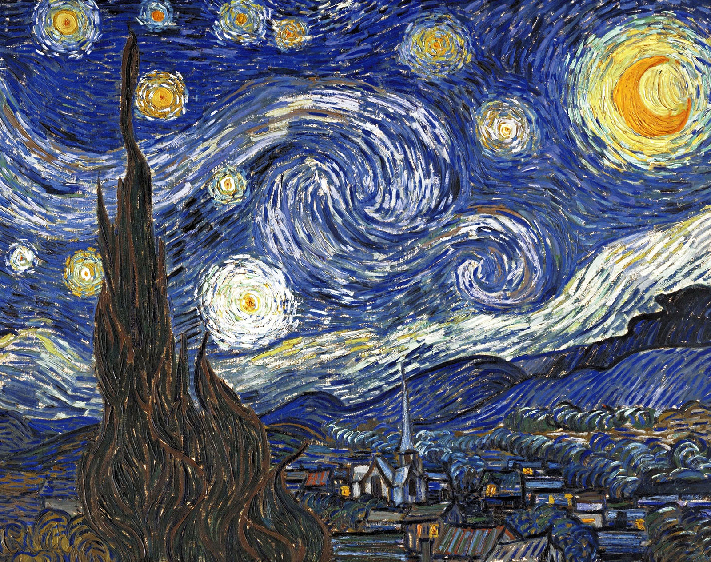
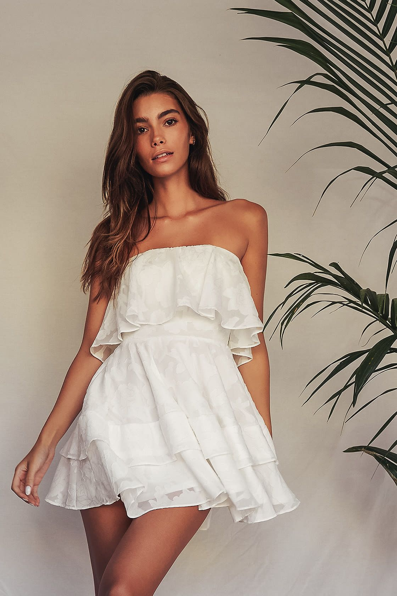

# Deep Learning Project: The Fitting Room in Your Dream

Team Members: Ming Zhang, Binqi Shen, Hanyu Cai, Junpeng Jiang, Xuan Yu, Chelsea Zhang

## PROBLEM STATEMENT

During the coronavirus pandemic, a lot of retailers have to close their fitting rooms to avoid close human interactions. In order to prevent viral transmission, virtual try-ons have started to gain more popularity. Through virtual try-ons, shoppers are able to mimic in-store experience and try on products such as makeup, tops, pants, dresses, sunglasses, etc..

Our project, centered on clothing virtual try-ons, is going to make shoppers’ experience more creative through incorporating their own designs into their clothes. A key advantage of our model is that users will be able to explore how famous artwork could be incorporated into their own clothing designs and gain purchasing insights. Leveraging Deep Learning, the final model will ask the shopper to upload 2 images: the first image would be an image of the shopper, the second would be a user input image (e.g. could be a designer logo, a pet the user owns, or even a picture of the user’s favorite food) to generate new clothing designs from. Our model would first generate new designs based on the user input, then identify the clothes shoppers wear, and finally transfer shoppers’ ideas into clothes design and generate an image of the user wearing the desired design.

Due to the technical difficulties resulting from the complexities of clothes styles and poses, our project focused on dresses and restricted the user input images to front pose images. During the final stages of our project, we also conducted a user study and invited some volunteers to try out our model and evaluate its performance. Our model was able to handle the input image appropriately and generate satisfactory synthesized images. 

## DATASET

Since we are trying to build a virtual fitting room, having various styles of clothes becomes fundamental. Pinterest is a public website which stores tons of photographs of different outfitting posts. Therefore, scraping more than 2000 photos about dresses became the first step. However, during the modeling process, we found that a good segmentation of clothes from the image required us to label the area of dress at the pixel level of an image, which is, the image needed to tell the exact pixels that correspond to the dress. As a result, we changed our training dataset to a fine-grained segmented data for fashion and apparel with more than 50000 pictures, which was posted by IMaterialist Fashion 2019 at FGVC6. The new data pinpointed the exact location for every kind of clothes, and we used the dress portion of it. 

Most of the images we got from Pinterest have the front look of the women wearing the dress. However, we do expect to see certain noises within the image sets, as the absolute shape and positioning of the outfit within each image can be largely different. As most of the pictures are clear and recognizable, we expect the model to correctly identify clothes from the images. Below are some examples of our dataset: 

 &nbsp; &nbsp; &nbsp; &nbsp; &nbsp;  &nbsp;  &nbsp; &nbsp; &nbsp; &nbsp; &nbsp;  &nbsp;  &nbsp; &nbsp; &nbsp; &nbsp; &nbsp;  &nbsp;  
                   
Since our dataset will be mainly used in semantic segmentation, there is no need for us to reshape or crop our images like what we usually do in the traditional classification problem. The main model we will use performs squeezing and augmenting of an image, but it is quite different from adding randomness to our model. We will explain it in detail in the following sections. 
	                           
## TECHNICAL APPROACH

Our overall technical approach consists of three steps: First of all, we would use **neural style transfer** to generate a new design based on two images: a famous artwork and a content image uploaded by the user. The content image could be a picture of someone’s beloved pet, favorite designer brand logo, or anything else that is meaningful to the shopper. In the second step, we then **distinguish the clothes from the background** and identify the area of clothes using convolutional neural networks. In the last step, we would **integrate the synthesized design** from our first step with the original pose and clothes, and finally output the synthesized image. The output image would then be shown to the shoppers. 

***Step 1***

For the first step in our technical approach, we would need two images from the shoppers. A style image of one’s favorite artwork and a content image of one’s pet or favorite brand. The output from this step is an image of the new design which incorporates both the features from the content image and the style/pattern from the style reference image using neural style transfer. The basis of neural style transfer has to do with a property we learned in class, which is that the lower layers generally look for lower level features whereas the higher layers usually look for features with increasing complexity. 

Our pretrained model tries to match the corresponding content and style representations with the features from the images in the intermediate layers. In order to optimize the output image content to a particular style specified, we would need to minimize our cost function, which consists of both style loss and content loss. Content loss is like comparing the representation of the original image to the representation of the new image in a certain layer. We would want them to match in the higher layers of the network. On the other hand, we want to use lower level representations when calculating style loss because we want to capture the patterns and features in the style image. In order to minimize both losses, neural style transfer usually needs to train for a long time to reach a satisfactory result. 

For our project, it is crucial to satisfy shoppers’ inquiries in real time. Therefore the speed of style transfer is quite important. We decided to use a pretrained model on Tensorflow which includes the pretrained weights and allows fast style transfer. The disadvantage of this model is that we cannot control the way of combining feature representations, but it is able to generate output within 10 seconds. 
Below are some examples of the generated designs from the first step: 

           Content Image             +             Style Image            =         Stylized Design
           
&nbsp;  &nbsp;  &nbsp;  &nbsp; &nbsp; &nbsp; &nbsp; &nbsp; &nbsp; &nbsp; &nbsp; + &nbsp;  &nbsp;  &nbsp;  &nbsp; &nbsp;  &nbsp;  &nbsp;  &nbsp;  &nbsp;  &nbsp;  &nbsp; &nbsp;  &nbsp;  &nbsp; = &nbsp;  &nbsp;  &nbsp;  &nbsp; &nbsp;  &nbsp;  &nbsp;  

&nbsp;  &nbsp;  &nbsp;  &nbsp; &nbsp; &nbsp; &nbsp; &nbsp; &nbsp; &nbsp; &nbsp; + &nbsp;  &nbsp;  &nbsp;  &nbsp; &nbsp;  &nbsp;  &nbsp;  &nbsp;  &nbsp;  &nbsp;  &nbsp; &nbsp;  &nbsp;  &nbsp; = &nbsp;  &nbsp;  &nbsp;  &nbsp; &nbsp;  &nbsp;  &nbsp;  

&nbsp;  &nbsp;  &nbsp;  &nbsp; &nbsp; &nbsp; &nbsp; &nbsp; &nbsp; &nbsp; &nbsp; + &nbsp;  &nbsp;  &nbsp;  &nbsp; &nbsp;  &nbsp;  &nbsp;  &nbsp;  &nbsp;  &nbsp;  &nbsp; &nbsp;  &nbsp;  &nbsp; = &nbsp;  &nbsp;  &nbsp;  &nbsp; &nbsp;  &nbsp;  &nbsp;  

***Step 2***

For the second step, our goal is to locate every pixel which represents clothes. More specifically, given an image with a human wearing a dress, we want to pinpoint the area where the dress appears. Our model in this step will take a colorful posture image as input,  and return a binary image with the white area standing for the dress silhouette. 
                                             
                       Input                                                            Output

&nbsp;  &nbsp; &nbsp; &nbsp; &nbsp; &nbsp; &nbsp; &nbsp; &nbsp; &nbsp; &nbsp;  &nbsp;  &nbsp; &nbsp; &nbsp; &nbsp; &nbsp; &nbsp; &nbsp; &nbsp; &nbsp;  &nbsp;  &nbsp;  &nbsp; &nbsp; &nbsp; &nbsp; &nbsp; &nbsp; &nbsp; &nbsp; &nbsp;&nbsp; &nbsp; &nbsp; &nbsp; &nbsp; &nbsp; &nbsp; &nbsp; &nbsp;&nbsp; &nbsp;  &nbsp;  &nbsp; &nbsp; &nbsp; &nbsp; &nbsp; &nbsp; &nbsp; &nbsp; &nbsp; &nbsp;  

The main idea of this model is mostly from clothes_segmentation, a github repository which shows us the code for binary segmentation of various clothes. The fundamental architecture of this model is the UNET, which is a fully convolutional neural network model used for semantic segmentation. It was initially invented to conduct segmentation tasks with biomedical images. The architecture of it involves two paths. The encoder path is used to capture the context in the image, which is just like a traditional convolutional layer with max polling. This step is used to contract the image. The decoder path is the  expanding path which is used to enable precise localization using transposed convolutions. Overall, we squeeze the picture first as the traditional convolutional neural network does, and then up sample the pixels to get the full picture using techniques like bi-linear, bi-cubic, or nearest neighbor interpolation. 
The training process of this step takes a long while, and we do not have enough resources to iterate our model to a desired level. As a result, we decided to utilize the pretrained parameters from Pytorch. The model now can detect the area of the dress accurately, but it will sometimes misclassify other accessories as parts of the dress. 

***Step 3***

The third step in our technical approach is design integration. From step 2, we got a masked picture, which is actually a matrix that has positive values only on the clothes part. Pixels in all other parts are 0, and is shown by black color in the image. Thus, in order to combine the newly generated designs with the masked picture we got from the second step, we recursively replace the pixel on the original image with the pixel on the new masked matrix if the value is positive.

The pictures below are the original images and corresponding resulting images of our model. The ladies are trying on dresses with their own designs which were generated in the previous steps. 
   
 &nbsp; &nbsp; &nbsp; &nbsp; &nbsp;  &nbsp;   &nbsp; &nbsp; &nbsp; &nbsp; &nbsp; &nbsp;  &nbsp; &nbsp; &nbsp; &nbsp; &nbsp; &nbsp; 

## Learning from MVP and Make Improvements
In our midterm checkpoint, we faced the difficulty of correctly identifying the clothes from the other parts of the body (e.g.: legs, faces, arms, etc.). Therefore we tried out some more pretrained models and frameworks to see if we would be able to apply transfer learning and save some computing expenses. Our final model was able to tackle this problem and improve the accuracy by a great extent. In addition, our Minimum Viable Product only focuses on the front dress looks with clean backgrounds, however, our final model was able to accurately pinpoint pixels that correspond to clothes. 
We were able to leverage the style transfer part from doing the MVP. Thanks to the results we got from multiple neural style transfer models with different parameters during the MVP, we were able to understand the advantages and drawbacks of each and pick the most suitable one for our final model pipeline. 

We believe that the models we used and built were the best suited model for our problem. Each step is pretty fast to run which allows shoppers to get insights in a timely manner. As mentioned above, there might be some neural style transfer models that are able to generate more satisfying results but take a long time to train. Therefore we would rather not use those considering the time constraints and user experience perspectives. 

## RESULTS

The newly generated designs from our final model are satisfactory most of the time. Based on the output pictures shown in the previous section, the generated designs are considered fashion and our model is able to pinpoint the clothes on the image uploaded and help users try on clothes they designed. 6 of us in our team and 10 volunteers tried our model. 15 out of 16 people really liked the resulting synthesized image and appreciated the newly generated design. Therefore we believe we’ve found the ‘best’ approach to our problem. 

Our final model was able to improve upon the MVP and our progress in the midterm checkpoint by a great extent. Although the model we have in the midterm checkpoint was able to identify clothes from the background, it was not able to pinpoint clothing pixels from the person’s body and face, which could largely impact the user experience of our model. In our final model, this problem was fixed and our model was able to accurately pinpoint the clothing pixels from the person’s body and skin. 

A modified version of our problem that could be more readily solved would be to only allow users to upload pictures of their clothes with a clear white background without trying them on. In such cases, there would not be any human faces or bodies in the pictures uploaded and the model would not need to distinguish clothes from the person anymore. 

Although our current model is able to accurately identify clothing pixels from the human body, it now only works for one-piece clothes such as dresses. It might be harder to identify shirts from pants in the same image because it is hard for machines to ‘learn’ such patterns or even accurately pinpoint the exact clothing pixels that correspond to each clothing part. It might take huge computation costs and extremely long time to train a model from the start that is able to distinguish all types of clothes or all kinds of poses and gestures. 

Initially, we did not have enough data to build a model on our own. However, after learning the fact that we are able to apply transfer learning and build upon the models the predecessors have built, we were able to use the pretrained weights and train our model much faster. As a result, our synthesized images were quite satisfying and successful. 

If time and computation power are not concerning, some neural style transfer models we built in the MVP stage were able to generate more satisfying stylized images sometimes. However, they take too long to train and output the synthesized images compared to our final model deployed. In the meantime, the final model is still able to produce good-looking designs with much less computation power and time. Therefore we are willing to sacrifice some aesthetic aspects of the designs for users’ precious time. 

## CONCLUDING REMARKS AND FUTURE WORK 

We believe that the work we did would be applicable to a commercial environment because various audiences would benefit from our model. Shoppers would not only be able to get an unique try-on experience, but also gain more purchasing insights. If the shoppers are satisfied with the virtual try-on experience and willing to share their data, then we could potentially deploy our model and share our data to the industry. Clothing retailers would benefit from using Deep Learning to make virtual try-ons more creative. One of the main advantages we foresee is that retailers are able to incorporate shoppers’ preferences of designs into their future products. Trending colors could be easily identified and promoted based on shoppers’ behavioral characteristics as well. 

If time allows, some improvement potentials we foresee before deploying our model include adding more clothes types to attract more users, adjusting the transparency of newly generated clothes before plugging it back to the picture to maintain features like texture, and adding features like recommending similar products that are currently in the retail market. 
